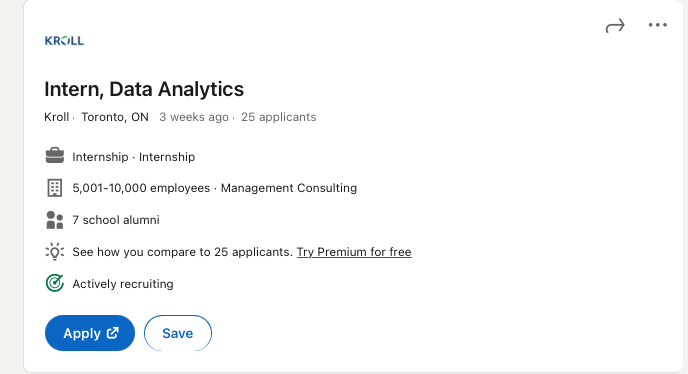
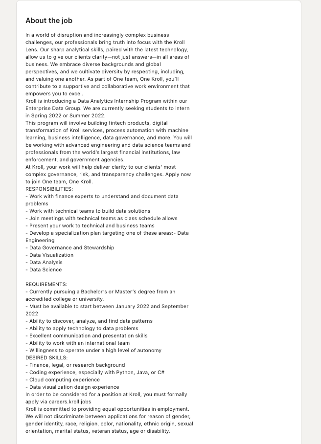
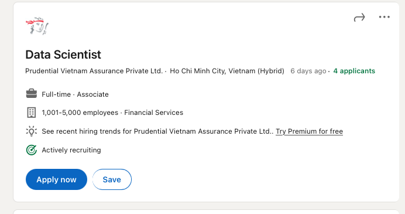
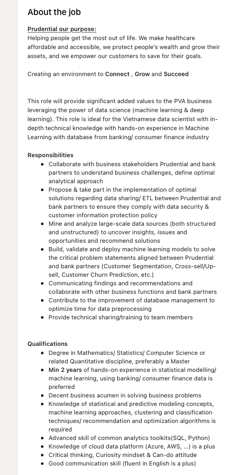
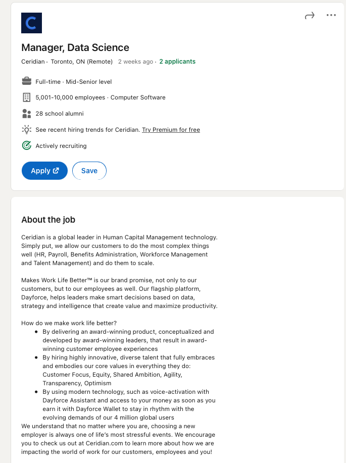
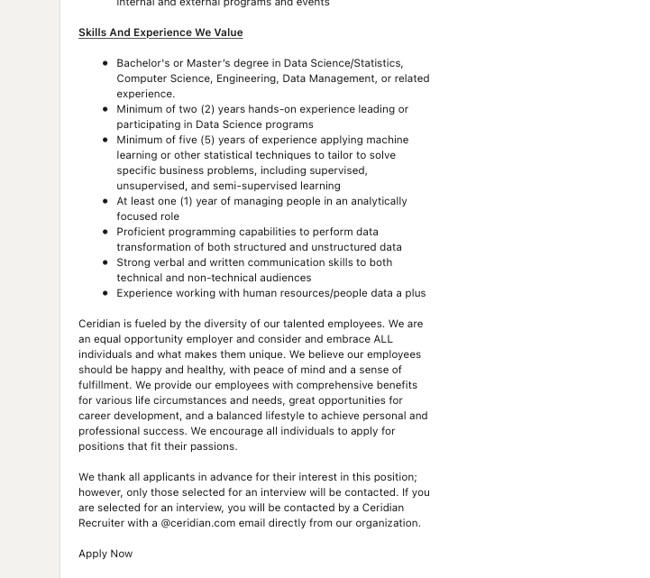

# Task 1: Data Science Careers
**Job 1: Kroll (Intern, Data Analytics)**
Link: 

**Job 2: Prudent (Data Science)**
Link: 

**Job 3: Ceridian (Manager, Data Science)**
Link: 

Here, I included 3 data-science-related jobs, with skill and experience requirements in increasing order. The first job is an internship at Kroll. Compared to other Data science/data analytics internships, it appears to allow interns to perform tasks outside of data cleaning/gathering. The description also mentions how the intern will be able to produce "data solutions" instead of only maintaining their current infrastructures, which I would love to have experience on. The second job is a Data Science role at Prudence, Vietnam. This position requires machine learning knowledge and experience, however, the job description doesn't limit the employee's responsibility to only as a machine learning engineer but also allow them to work with customers and other teams in the company to, for example, "understand business challenges, define the optimal analytical approach." The role is also based in Vietnam, where data science roles within companies are limited and somewhat ignored, therefore I would like to challenge myself in such an industry. The third job posting is by Ceridian for the role of Manager of a Data Science team. This job is the most prestigious out of the 3, not only requiring a Data Science specialty but also experience in management. Not only have to overlook the team of data scientists and machine learning engineers, but the manager also has to conduct research and provide "educational growth" to the company. I would like to contribute to the company I work at, not only in a technical aspect but also at the management level, and roles like this would be what I aim for after a few years in the field.

# Task 2: Highs and Lows

The highlights of the class for me are the Munch & Mingle sessions that we have together. Not only that I had the chance to connect with my peers and the professor, but also to answer some technical questions I have as well as gain insights into the industries. The assignments are great, too! It helped me gain many new skills, learn about new technologies, and give me many ideas for my projects! Long story short, after the assignment on Reddit data analytics, I created my own Spotify data analytics short project, and develop an interest in audio analysis techniques using machine learning! I have no better words to describe this course, and I can't overstate all the wonderful doors that the professor and the TAs' have opened for me. I also am way more confident as an aspiring data scientist, maybe not in my technical skills and knowledge (yet), but in how I can use data science tools and skills to do what I want and "fix" what I care about in the real world.
Thank you very much for this opportunity, we appreciate everything you guys do.
